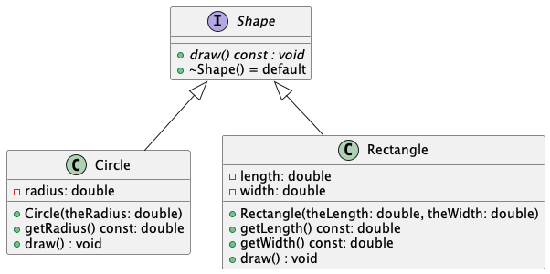
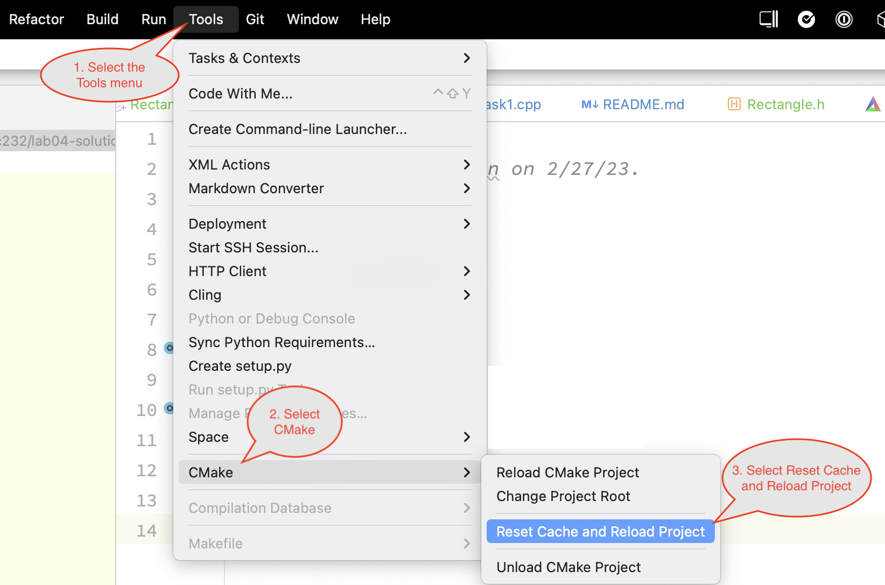
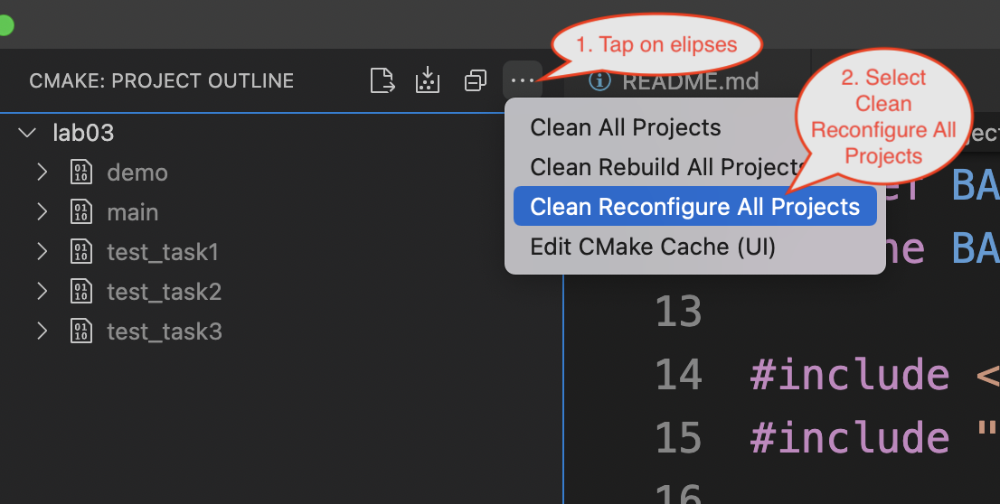
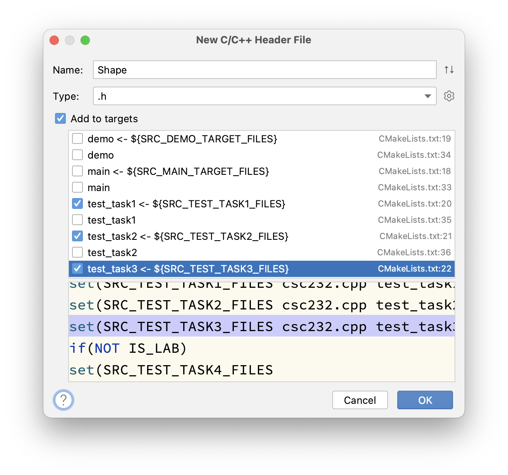
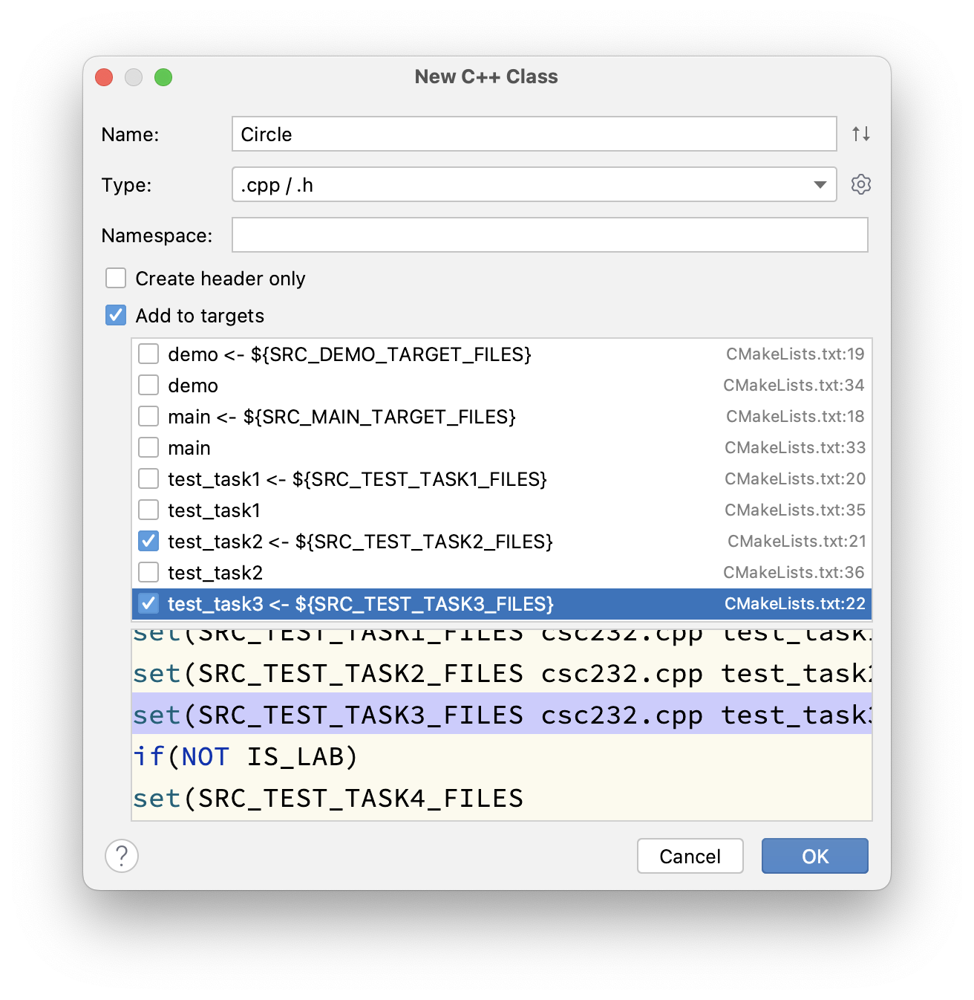
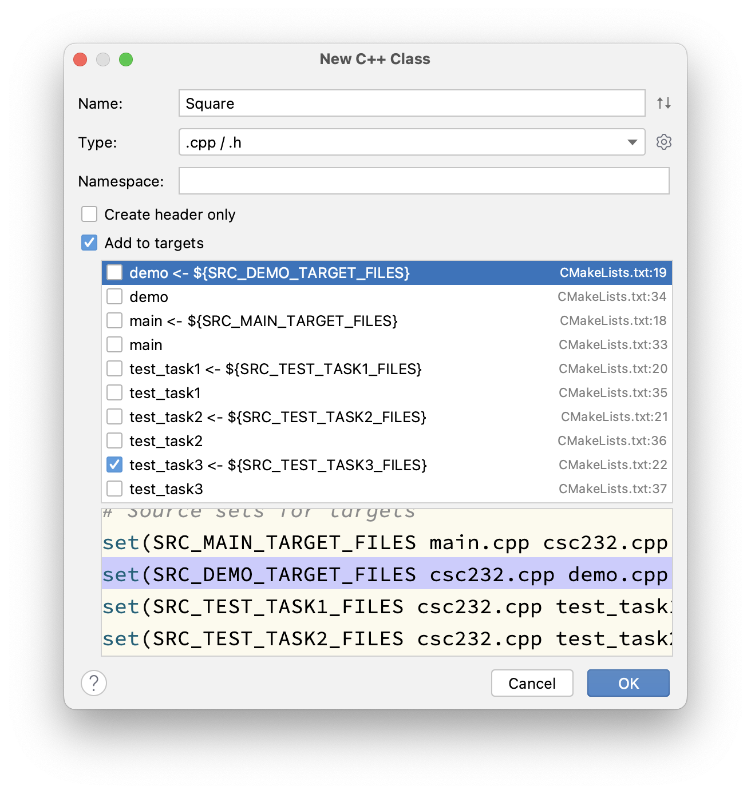

# LAB04 - Introduction to Polymorphism

In this lab we explore the concept of **polymorphism** with a simple class hierarchy of shapes.

## Due Date

This assignment is due Saturday, March 4, 2023 by 23:59:59.

## Background

Polymorphism is a fundamental tenant of object-oriented programming (OOP).



**NOTE**: In the class diagram shown above, private data members are indicated with a red, hollow, square icon. Public member functions are indicated with a green, filled, circular icon.

### Advanced Reading

- General > Files > Class Materials > Setting Up WSL for CSC232.pdf
- Carrano & Henry, 
  - Chapter 1 Data Abstraction: The Walls
  - C++ Interlude 1 C++ Classes
  - C++ Interlude 2 Pointers, Polymorphism, and Memory Allocation

## Objectives

Upon successful completion of this lab, the student

- understands the concept of polymorphism
- knows how to demonstrate polymorphic behavior
- knows the difference between early and late binding of class methods

## Tasks

1. Task 1: Create a Shape interface
2. Task 2: Create a Circle class that implements the Shape interface
3. Task 3: Create a Square class that implements the Shape interface

In each of these tasks, you are asked to create new files. It is imperative that you follow the instructions carefully and use the prescribed naming conventions. 

Further, note that the unit tests are reading the contents of the files you are working on for any given task. As such, if you find yourself changing the contents of a file in an effort to get some unit test to pass, you'll need to reset `cmake`'s cached files and reload the CMake project. 

If you're using CLion, this is done under the Tools menu as shown below:



If you're using Visual Studio Code, this is done via the use of the CMake extension (plugin) as shown here:



### Task 1: Create a shape interface

1. Create a new file named `Shape.h` in the root folder of your repository. NOTE: The filename **must** match exactly as specified in this step. If it does not, the test task for this task will not build.
2. Add this new file to the three test task targets in the `CMakeLists.txt` file. If you're using CLion, this can easily be done when you first create the file, as shown below by selecting the "Add to targets" checkbox and the corresponding target variables:

   

   If you are not using CLion, you can just edit the `CMakeLists.txt` file directly. Simply change the following lines

   ```cmake
   set(SRC_TEST_TASK1_FILES csc232.cpp test_task1.cpp)
   set(SRC_TEST_TASK2_FILES csc232.cpp test_task2.cpp)
   set(SRC_TEST_TASK3_FILES csc232.cpp test_task3.cpp)
   ```
   
   to include the name of the new file you created in the previous step
   
   ```cmake
   set(SRC_TEST_TASK1_FILES csc232.cpp test_task1.cpp Shape.h)
   set(SRC_TEST_TASK2_FILES csc232.cpp test_task2.cpp Shape.h)
   set(SRC_TEST_TASK3_FILES csc232.cpp test_task3.cpp Shape.h)
   ```
   
   Be sure to add them to all three test targets, even though it's first created here in the first task. It will be needed in the other tasks (as a dependency), so you may as well set all three targets now.

3. Using the class diagram found in the [Background](#background) as your guide, code this interface accordingly. Keep in mind: the diagram shows `Shape` to be an interface. This means then, that the methods shown should be _declared_ as **pure virtual** functions (making this, in reality, an abstract class in C++).
4. When you have completed this task, toggle the `SKIP_TESTING_TASK_1` macro from `TRUE` to `FALSE`.
5. Build and execute the `test_task1` target to test your solution. Alternatively, you can do build and execute the `All CTest` target.
6. When all the tests for this task pass, stage, commit and push your changes to GitHub. NOTE: If your tests are failing, and you're making changes to get them to pass, be sure to follow the instructions above on resetting and reloading cmake.

### Task 2: Create a Circle class that implements the Shape interface

1. Create two new files named `Circle.h` and `Circle.cpp`.
2. Add this new file to the next two test task targets in the `CMakeLists.txt` file. If you're using CLion, this can easily be done when you first create the files, as shown below by selecting the "Add to targets" checkbox and the corresponding target variables:

   

   If you are not using CLion, you can just edit the `CMakeLists.txt` file directly. Simply change the following lines

   ```cmake
   set(SRC_TEST_TASK2_FILES csc232.cpp test_task2.cpp Shape.h)
   set(SRC_TEST_TASK3_FILES csc232.cpp test_task3.cpp Shape.h)
   ```

   to include the name of the new files you created in the previous step

   ```cmake
   set(SRC_TEST_TASK2_FILES csc232.cpp test_task2.cpp Shape.h Circle.cpp Circle.h)
   set(SRC_TEST_TASK3_FILES csc232.cpp test_task3.cpp Shape.h Circle.cpp Circle.h)
   ```
   
   Be sure to add them to all the last two test targets, even though it's first created here in the second task. They will be needed in the next task as well (as a dependency), so you may as well set all the relevant targets now.

3. Using the class diagram found in the [Background](#background) as your guide, code this class accordingly. Be sure to mark the appropriate method as an override.
4. When you have completed this task, toggle the `SKIP_TESTING_TASK_2` macro from `TRUE` to `FALSE`.
5. Build and execute the `test_task2` target to test your solution. Alternatively, you can do build and execute the `All CTest` target.
6. When all the tests for this task pass, stage, commit and push your changes to GitHub. NOTE: If your tests are failing, and you're making changes to get them to pass, be sure to follow the instructions above on resetting and reloading cmake.

### Task 3: Create a Square class that implements the Shape interface

1. Create two new files named `Rectangle.h` and `Rectangle.cpp`.
2. Add these new files to the third test task target in the `CMakeLists.txt` file. If you're using CLion, this can easily be done when you first create the files, as shown below by selecting the "Add to targets" checkbox and the corresponding target variables:

   

   If you are not using CLion, you can just edit the `CMakeLists.txt` file directly. Simply change the following lines

   ```cmake
   set(SRC_TEST_TASK3_FILES csc232.cpp test_task3.cpp Shape.h Circle.cpp Circle.h)
   ```

   to include the name of the new files you created in the previous step

   ```cmake
   set(SRC_TEST_TASK3_FILES csc232.cpp test_task3.cpp Shape.h Circle.cpp Circle.h Rectangle.cpp Rectangle.h)
   ```
   Be sure to add them to just the last test target.

3. Using the class diagram found in the [Background](#background) as your guide, code this class accordingly. Be sure to mark the appropriate method as an override.
4. When you have completed this task, toggle the `SKIP_TESTING_TASK_3` macro from `TRUE` to `FALSE`.
5. Build and execute the `test_task3` target to test your solution. Alternatively, you can do build and execute the `All CTest` target.
6. When all the tests for this task pass, stage, commit and push your changes to GitHub. NOTE: If your tests are failing, and you're making changes to get them to pass, be sure to follow the instructions above on resetting and reloading cmake.

## Submission Details

Before submitting your assignment, be sure you have pushed all your changes to GitHub. If this is the first time you're pushing your changes, the push command will look like:

```bash
git push -u origin develop
```

If you've already set up remote tracking (using the `-u origin develop` switch), then all you need to do is type:

```bash
git push
```

As usual, prior to submitting your assignment on Microsoft Teams, be sure that you have committed and pushed your final changes to GitHub. Once your final changes have been pushed, create a pull request that seeks to merge the changes in your `develop` branch into your `trunk` branch. Once your pull request has been created, submit the URL of your assignment _repository_ (i.e., _not_ the URL of the pull request) on the Teams Assignment as a Link Resource. Please note: the timestamp of the submission on Teams is used to assess any late penalties if and when warranted, _not_ the date/time you create your pull request. **No exceptions will be granted for this oversight**.

### Grading Rubric

This assignment is worth **3 points**.

| Criteria           | Exceeds Expectations         | Meets Expectations                  | Below Expectations                  | Failure                                        |
|--------------------|------------------------------|-------------------------------------|-------------------------------------|------------------------------------------------|
| Pull Request (20%) | Submitted early, correct url | Submitted on-time; correct url      | Incorrect URL                       | No pull request was created or submitted       |
| Code Style (20%)   | Exemplary code style         | Consistent, modern coding style     | Inconsistent coding style           | No style whatsoever or no code changes present |
| Correctness^ (60%) | All unit tests pass          | At least 80% of the unit tests pass | At least 60% of the unit tests pass | Less than 50% of the unit tests pass           |

^ _The Google Test unit runner will calculate the correctness points based purely on the fraction of tests passed_.

### Late Penalty

* In the first 24-hour period following the due date, this lab will be penalized 0.6 point meaning the grading starts at 2.4 (out of 3 total possible) points.
* In the second 24-hour period following the due date, this lab will be penalized 1.2 points meaning the grading starts at 1.8 (out of 3 total possible) points.
* After 48 hours, the assignment will not be graded and thus earns no points, i.e., 0 out of 3 possible points.
